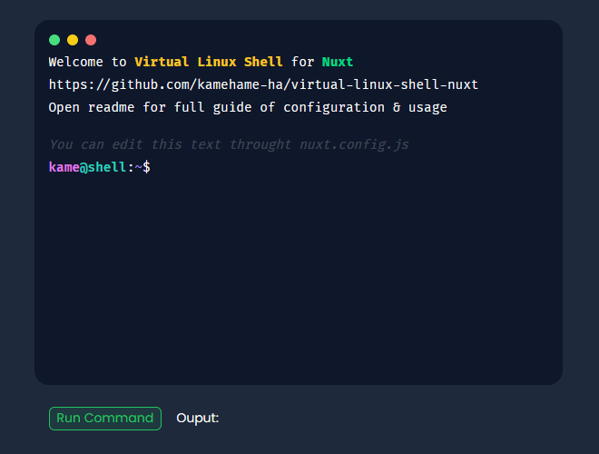
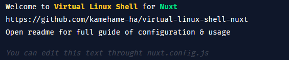
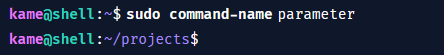
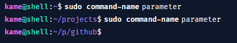
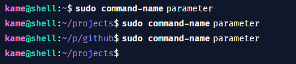
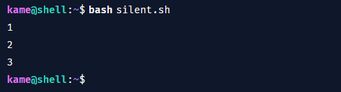
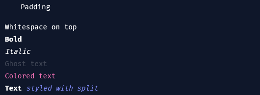

<a name="readme-top"></a>

<!-- PROJECT LOGO -->
<br />
<div align="center">

<h3 align="center">Nuxt Virtual Linux Shell</h3>

  <p align="center">
    Nuxt component that works like linux shell, feature rich & fully customizable
    <br />
    <a href="#documentation"><strong>Documentation »</strong></a>
    <br />
    <br />
    <a href="https://github.com/kamehame-ha/nuxt-virtual-linux-shell">Live Demo</a>
  </p>
</div>


<!-- TABLE OF CONTENTS -->
<details>
  <summary>Table of Contents</summary>
  <ol>
    <li>
      <a href="#about-the-project">About The Project</a>
      <ul>
        <li><a href="#built-with">Built With</a></li>
      </ul>
    </li>
    <li>
      <a href="#basic-implementation-guide">Basic implementation guide</a>
      <ul>
        <li><a href="#prerequisites">Prerequisites</a></li>
        <li><a href="#adding-shell-to-your-project">Adding shell to your project</a></li>
        <li><a href="#basic-usage">Basic usage</a></li>
      </ul>
    </li>
    <li><a href="#contributing">Contributing</a></li>
    <li><a href="#license">License</a></li>
    <li><a href="#documentation">Documentation</a></li>
    <li><a href="#contact">Contact</a></li>
  </ol>
</details>


<!-- ABOUT THE PROJECT -->
## About The Project

![Product Name Screen Shot][product-screenshot]

<p align="right">(<a href="#readme-top">back to top</a>)</p>


### Built With

* Nuxt.js
* TailwindCSS
* EventEmitter3
<p align="right">(<a href="#readme-top">back to top</a>)</p>


<!-- GETTING STARTED -->
## Basic implementation guide

Here's quick guide how to copy shell to your nuxt project

For more detailed configuration guide goto [/documentation](#documentation)

### Prerequisites

Install LTS version of NodeJS: https://nodejs.org/en/download

Then create new nuxt project (if you don't have one)
  ```sh
  npx nuxi@latest init my-project
  ```

Install required nuxt modules and npm packages:
```sh
npm i @nuxtjs/tailwindcss eventemitter3
```

Enable tailwindCSS module in your project:
```ts
// nuxt.config.ts
modules: ['@nuxtjs/tailwindcss']
```

*Note: Tailwind is needed for text styling*

### Adding shell to your project

Copy contents of `/components` and `/composables` folders, also copy whole `/types` folder to your project.

Or download needed files as .zip from releases tab

Then import `<VirtualShell></VirtualShell>` component to vue file of your choice and you are ready to go  🥳

<p align="right">(<a href="#readme-top">back to top</a>)</p>

<!-- USAGE EXAMPLES -->
## Basic Usage

To execute shell command use `useVirtualShell()` composable like so:
```ts
// yourfile.vue > methods > runCommand
executeScript() {
    useVirtualShell().activateScript({
        cmd: {
            name: 'shell',
            parameters: '--help',
        }
    }, ({ finish }) => {
        finish()
    })
}
```
Output:



<p align="right">(<a href="#readme-top">back to top</a>)</p>


<!-- CONTRIBUTING -->
## Contributing

Contributions are what make the open source community such an amazing place to learn, inspire, and create. Any contributions you make are **greatly appreciated**.

If you have a suggestion that would make this better, please fork the repo and create a pull request.
Don't forget to give the project a star! Thanks again!

What is even more appreciated is creating version of this component for other frameworks ex. **React** or simply **Vanilla JS**, 
**But please add link to this repo in your project** 😉

*If you created version of this project, contact me. I'll put the link here*

<p align="right">(<a href="#readme-top">back to top</a>)</p>


<!-- LICENSE -->
## License

Distributed under the MIT License. See `LICENSE.txt` for more information.

<p align="right">(<a href="#readme-top">back to top</a>)</p>


## Documentation

<details>
  <summary>Table of Contents</summary>
  <ol>
    <li>
      <a href="#configuration">Configuration</a>
    </li>
    <ul>
        <li>
        <a href="#text">text</a>
        </li>
        <li>
        <a href="#info">info</a>
        </li>
        <li>
        <a href="#startuplogin">startupLogin</a>
        </li>
        <li>
        <a href="#textmodifiers">textModifiers</a>
        </li>
    </ul>
    <li>
      <strong><a href="#usevirtualshell">useVirtualShell()</a></strong>
    </li>
    <ul>
        <li>
        <a href="#executescript">executeScript()</a>
        </li>
        <ul>
            <li>
            <a href="#-script">script options</a>
            </li>
            <ul>
                <li>
                <a href="#-cmd">cmd</a>
                </li>
                <li>
                <a href="#-text">text</a>
                </li>
                <li>
                <a href="#-custom_html">custom_html</a>
                </li>
                <li>
                <a href="#-input">input</a>
                </li>
                <li>
                <a href="#-silent">silent</a>
                </li>
            </ul>
            <li>
            <a href="#-callback">callback()</a>
            </li>
            <ul>
                <li>
                <a href="#-script_data">script_data</a>
                </li>
                <li>
                <a href="#-input_value">input_value</a>
                </li>
                <li>
                <a href="#-finish">finish()</a>
                </li>
                <li>
                <a href="#-sendcommunicate">sendCommunicate()</a>
                </li>
            </ul>
        </ul>
        <li>
        <a href="#">onShellLoad()</a>
        </li>
    </ul>
    <li>
      <a href="#text-styling">Text Styling</a>
    </li>
    <ul>
        <li>
        <a href="#text-modifiers">Text Modifiers</a>
        </li>
        <li>
        <a href="#padding">Padding</a>
        </li>
        <li>
        <a href="#whitespace">Whitespace</a>
        </li>
        <li>
        <a href="#bold">Bold</a>
        </li>
        <li>
        <a href="#ghost-text">Ghost Text</a>
        </li>
        <li>
        <a href="#italic">Italic</a>
        </li>
        <li>
        <a href="#split">Split</a>
        </li>
        <li>
        <a href="#color">Color</a>
        </li>
    </ul>
  </ol>
</details>
<p align="right">(<a href="#readme-top">back to top</a>)</p>


### Configuration
Shell configuration can be performed using `runtimeConfig().public` in nuxt.config.ts

```ts
runtimeConfig: {
    public: {
        virtualShell: {
            // options
        }
    }
}
```
<p align="right">(<a href="#readme-top">back to top</a>)</p>


#### text
`text` option represents shell startup text, text is generated like every other text in the shell so it supports [text styling](#text-styling)

```ts
runtimeConfig: {
    public: {
        virtualShell: {
            text: string | Array<string>
        }
    }
}
```


<p align="right">(<a href="#readme-top">back to top</a>)</p>


#### info
`info` is used to change default fake username and fake host name

```ts
runtimeConfig: {
    public: {
        virtualShell: {
            info: {
                username: string,
                host: string
            }
        }
    }
}
```
<p align="right">(<a href="#readme-top">back to top</a>)</p>


#### startupLogin
When enabled shell on startup will show fake SSH login sequence

```ts
runtimeConfig: {
    public: {
        virtualShell: {
            startupLogin: {
                user: string,
                password: string
            }
        }
    }
}
```
<p align="right">(<a href="#readme-top">back to top</a>)</p>


#### textModifiers
`textModifiers` is used to change default value of selected [text modifiers](#text-modifiers)

*Every value of modifier needs to be valid tailwindCSS class or be defined in your CSS*

```ts
runtimeConfig: {
    public: {
        virtualShell: {
            textModifiers: {
                padding: string,
                whitespace: {
                    start: string,
                    end: string
                },
                ghostText: string,
                bold: string
            }
        }
    }
}
```

<p align="right">(<a href="#readme-top">back to top</a>)</p>

### useVirtualShell()
Main function of virtual shell, composable returns 5 functions which are used to control component. `executeScript()` is most important... it's used to execute shell scripts. Other functions are used by component itself, but you can also use them to emit/receive shell script lifecycle events
```ts
// your-component.vue
useVirtualShell()
// executeScript, onStart, onFinish, emitFinish, onCommunicate
```

<p align="right">(<a href="#readme-top">back to top</a>)</p>

#### executeScript()
This function allows you to execute shell script using plenty of options.
```ts
useVirtualShell().executeScript({
    // script options
}, ({
    // callback
    }) => {

    })
```

<p align="right">(<a href="#readme-top">back to top</a>)</p>

##### > script
This value represents your script data, as you can see, there are so many options to choose from...

You can use array of scripts to make scripts execute one after another

<p align="right">(<a href="#readme-top">back to top</a>)</p>

##### > cmd
`cmd` is used to customize command which will be typed in shell
```ts
{
    cmd: {
        name: string
        parameters?: string | Array<string>
        sudo?: boolean
        cd?: Cd
    }
}
```
**name** - command name ex. nano

**parameters** - can be used as string or as array ex. --help

**sudo** - if enables will print `sudo` text before command


**cd** - like in shell it is used to open or go back from fake folder

```ts
cd: {
    mode: 'open' | 'go-back'
    dir?: string,
    go_back_to_default?: boolean
}
```
`mode` - if mode is set to 'open' `dir` option is needed otherwise it will not work, but if mode is 'go-back' any other option is optional

`dir` - should be typed without `/` character, there is no length limit but it may bug shell line style

`go_back_to_default` - if enabled shell will return to default `/` directory

Here's example of command with dir option:

```ts
useVirtualShell().executeScript({
    cmd: {
        name: 'command-name',
        parameters: 'parameter',
        sudo: true,
        cd: {
            mode: 'open',
            dir: 'projects'
        }
    }
}, ({ finish }) => {
    finish()
})
```



When you will open another folder, output will look like this:

```ts
cmd: {
    name: 'command-name',
    parameters: 'parameter',
    sudo: true,
    cd: {
        mode: 'open',
        dir: 'github'
    }
}
```



With `go-back` mode shell will simply return to the previous folder

```ts
cmd: {
    name: 'command-name',
    parameters: 'parameter',
    sudo: true,
    cd: {
        mode: 'go-back'
    }
}
```



<p align="right">(<a href="#readme-top">back to top</a>)</p>

##### > text
`text` is used to generate text in shell, of course it support [text styling](#text-styling)

```ts
{
    text: string | Array<string>
}
```

<p align="right">(<a href="#readme-top">back to top</a>)</p>

##### > custom_html
`custom_html` is used to generate custom html element with `innerHtml()` method

```ts
{
    custom_html: string
}
```

<p align="right">(<a href="#readme-top">back to top</a>)</p>

##### > input

`input` allows you to add inputs to shell commands and collect data from them
```ts
{
    input: {
        type?: 'text' | 'password' | 'number' | 'email' | 'url' | 'phone'
        attrs?: { 
            [param_name: string]: any 
        }
    }
}
```

As you can see all of the options are optional, input without any options will be generated as simple text input. But you will be still able to collect data from it. Options are only customization thing here

**type** - sets type of the input

**attrs** - it could be any html attribute with syntax showed below:

```ts
{
    input: {
        attrs: {
            placeholder: 'Write here'
        }
    }
}
```

<p align="right">(<a href="#readme-top">back to top</a>)</p>

##### > silent

If enabled script will finish without rendering command prompt

***This option works only in array***

In example below i executed 3 different commands, but they look like one

```ts
executeScript() {
    useVirtualShell().executeScript([
        {
            cmd: {
                name: 'bash',
                parameters: 'silent.sh'
            },
            text: '1',
            silent: true
        },
        {
            text: '2',
            silent: true
        },
        {
            text: '3',
        },
    ], ({ finish, sendCommunicate }) => {
        finish()
    })
}
```



<p align="right">(<a href="#readme-top">back to top</a>)</p>

##### > callback()
In callback you can access `input_value` `script_data` variables and functions `finish` `sendComunicate`
```ts
useVirtualShell().executeScript({}, ({ finish, script_data, input_value, sendComunicate }) => {
    // your function
})
```

##### > script_data

It is object of your script, used in [silent commands](#silent)

##### > input_value

Raw value of your input

##### > finish

Used to finish your command, optional variable need to be filled with `script_data` when [silent commands](#silent) are used

Missing `finish` function may cause various bugs in the shell

```ts
executeScript() {
    useVirtualShell().executeScript({
        cmd: {
            name: 'command1'
        }
    }, ({ finish }) => {
        finish()
    })
}
```

##### #-sendCommunicate

Used to send additional text to shell

```ts
executeScript() {
    useVirtualShell().executeScript({
        cmd: {
            name: 'command1'
        }
    }, ({ finish, sendCommunicate }) => {
        sendCommunicate('Important text')

        finish()
    })
}
```

<details>
<summary><strong>Type definition</strong></summary>

```ts
type InputType = 'text' | 'password' | 'number' | 'email' | 'url' | 'phone'

interface Cd {
    mode: 'open' | 'go-back'
    dir?: string,
    go_back_to_default?: boolean
}

interface ShellCommand {
    name: string
    parameters?: string | Array<string>
    sudo?: boolean
    cd?: Cd
}

type Text = string | Array<string> 

type CustomHTML = string

type InputAttrs = { [param_name: string]: any }

interface Input  {
    id?: string
    type?: InputType
    attrs?: InputAttrs
}

export interface ShellScriptData {
    cmd?: ShellCommand
    text?: Text
    custom_html?: CustomHTML
    input?: Input
    silent?: boolean
}

type ShellScript = ShellScriptData | Array<ShellScriptData>
```

</details>


<p align="right">(<a href="#readme-top">back to top</a>)</p>

### Text Styling
Shell text can be styled using **modifiers** which are represented by `_` character, complete modifier looks like this `_<modifier_character>` ex. `_S`

Value of modifiers: `_P` `_W` `_G` `_B` can be edited in [/configuration](#configuration)

```ts
text: [
    '_PPadding',
    '_WWhitespace on top',
    '_BBold',
    '_IItalic',
    '_GGhost text',
    '_C[#f472b6]Colored text',
    '_BText_S _I_C[#818cf8]styled with split'
]
```


<p align="right">(<a href="#readme-top">back to top</a>)</p>


#### Text Modifiers
* `_P` - padding
* `_W` - whitespace
* `_B` - bold
* `_G` - ghost text
* `_I` - italic
* `_S` - split
* `_C[<hex_color>]` - color
<p align="right">(<a href="#readme-top">back to top</a>)</p>


#### Padding
It adds actual padding to a element

Default value: `pl-5`
<p align="right">(<a href="#readme-top">back to top</a>)</p>


#### Whitespace
Where white space will appear depends on where modifier is. If string starts with whitespace it'll be on the top, but if it ends with modifier it'll be on the bottom

Default value: `mt-4` or `mb-4`

*In tailwindCSS this is most equal value to `text-sm`*
<p align="right">(<a href="#readme-top">back to top</a>)</p>


#### Bold
It makes text bold

Default value: `font-bold`
<p align="right">(<a href="#readme-top">back to top</a>)</p>


#### Ghost text
It adds ghost text (secondary text) effect

*In UI/UX it means that text is less important, so color is different to force the more important text to be read first*

Default value: `opacity-20`
<p align="right">(<a href="#readme-top">back to top</a>)</p>


#### Italic
It makes text italic

Default value: `italic`
<p align="right">(<a href="#readme-top">back to top</a>)</p>


#### Split
Split modifier work exactly like `String.split()` method, it will split text in the selected place. Its used to style one or many words differently
<p align="right">(<a href="#readme-top">back to top</a>)</p>


#### Color
Changes text color to selected. Ex. `_C[#000000]` will change text color to black

*Color modifier changes color by using `element.style` method*
<p align="right">(<a href="#readme-top">back to top</a>)</p>


<!-- CONTACT -->
## Contact

Twitter - [@_kamehame_ha](https://twitter.com/_kamehame_ha)
Discord - [kamehame_ha](https://discord.com/users/552517126871842856)

Project Link: [https://github.com/kamehame-ha/nuxt-virtual-linux-shell](https://github.com/kamehame-ha/nuxt-virtual-linux-shell)

<p align="right">(<a href="#readme-top">back to top</a>)</p>


<!-- MARKDOWN LINKS & IMAGES -->
<!-- https://www.markdownguide.org/basic-syntax/#reference-style-links -->
[product-screenshot]: images/screenshot.png
